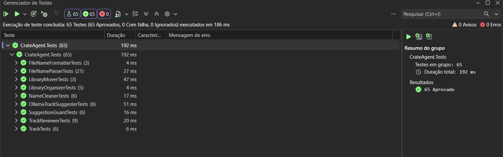

# 🎧 CrateAgent

[](https://github.com/AlessandraBatistaJ/crate-agent/actions/workflows/ci.yml)

Organizador de bibliotecas de música, feito em C# / .NET 8.
O projeto nasceu de um problema real: uma pasta de downloads do Bandcamp e de outras fontes, cheia de arquivos sem tags, com nomes sujos e códigos de selo misturados com o título.

> 🚧 **Em construção.** A base de organização está pronta e testada. O agente de IA local (Ollama) existe como **experimento que só sugere** e ainda não altera nenhum arquivo. Detecção de BPM e curador de sets são as próximas fases.



## O que já funciona

- ✅ **Scanner** que lê as tags dos arquivos de áudio (TagLibSharp)
- ✅ **Fallback pelo nome do arquivo** quando as tags estão vazias (hífen, meia-risca e travessão como separadores)
- ✅ **Limpeza de nomes**: remove a palavra "Premiere", posição de vinil (`A1`), código de lançamento (`MR021`) e o canal que aparece antes de "Premiere"
- ✅ **Revisão de faixas**: artista ausente, título suspeito ou prefixo descartado vão para a pasta `_Revisar`
- ✅ **Dry-run**: mostra para onde cada arquivo iria, sem mover nada
- ✅ **Mover de verdade** com log em JSON e **desfazer** pelo log
- ✅ **Avaliador de gabarito**: compara o resultado do programa com nomes que eu escrevi à mão
- ✅ **65 testes automatizados** com xUnit

## Como funciona

```
Pasta de músicas ─► Scanner ─► Limpeza ─► Revisão ─► Plano (dry-run) ─► Mover (com log)
                                                                              │
                                                              Desfazer ◄──────┘
```

Faixas com dados confiáveis vão para `Artista Nome/Artista_Nome - Título_Nome.mp3`.
Faixas duvidosas vão para `_Revisar`, **mantendo o nome original**.

Exemplo real (46 faixas de uma pasta de teste: 35 organizadas, 11 em revisão):

| Arquivo original | Destino |
|---|---|
| `MR036_Digital_Bonus_01_Human_Safari_-_Dorian.mp3` | `Human Safari/Human_Safari - Dorian.mp3` |
| `Premiere_Bailey_Ibbs_JKS_-_Rituals_SMILE006.mp3` | `Bailey Ibbs JKS/Bailey_Ibbs_JKS - Rituals_SMILE006.mp3` |
| `BCCO_Premiere_Red_Rooms_-_Debris_MR039.mp3` | `_Revisar/BCCO_Premiere_Red_Rooms_-_Debris_MR039.mp3` |
| `Night_Train.mp3` | `_Revisar/Night_Train.mp3` |

## Decisões de projeto

- **O código só move o que tem certeza.** O resto vai para revisão.
- **Ausência de informação não é um dado falso.** Por isso o BPM é `int?`, e não `int` com valor 0.
- **Nunca sobrescreve arquivos.** Se o destino já existe, a faixa é ignorada.
- **Tudo é reversível.** Cada movimentação é registrada em um log que permite desfazer. Testado movendo e desfazendo 46 arquivos.
- **Código de catálogo no título é mantido** (`Rituals_SMILE006`), porque carrega informação útil sobre o lançamento.
- **Prefixo descartado pede conferência.** Quando o programa remove o que vinha antes de "Premiere" (supondo que seja o canal), a faixa vai para `_Revisar`.

## Medindo em vez de achar

Para saber se as regras funcionam, escrevi um **gabarito**: o nome final esperado de 45 arquivos de teste. O avaliador (opção 3 do menu) compara o programa com ele.

| Versão | Acertos |
|---|---|
| Parser inicial | 32/45 (71%) |
| Com regras para canal, vinil e código no início do artista | 44/45 (98%) |

⚠️ **Ressalva importante:** as regras foram escritas olhando essas mesmas 45 faixas, então os 98% são otimistas. A prova justa exige uma pasta nova, com arquivos que o código nunca viu.

## IA local: o que eu medi

Testei o `llama3.2` (rodando local, via Ollama) para sugerir artista e título:

- Em 5 faixas com nomes sujos, acertou 1. O modelo ignorou o separador ` - ` e quebrou nomes no meio.
- Em 4 faixas **sem artista**, **inventou um artista** (`Ariana Grande`, sem nenhuma base no nome do arquivo) e repetiu o título como artista em outra.

Por isso a IA **só sugere**, e uma camada de regras (`SuggestionGuard`) rejeita sugestões com palavras que não estão no nome do arquivo, artista igual ao título ou título com separador. Nesses 4 casos, o guarda barrou as 2 sugestões erradas.
Conclusão atual: para extrair artista e título do nome do arquivo, regras funcionam melhor que um modelo pequeno. A IA fica reservada para tarefas em que regra não alcança.

## Limitações conhecidas

- A regra que trata o texto antes de "Premiere" como canal também remove artistas legítimos nessa posição. Exemplo real: em `SIAH Premiere bmod`, o `SIAH` faz parte do nome. Por isso essas faixas vão para revisão, e não são organizadas sozinhas.
- Duplicatas só são evitadas pelo nome (sufixo ` (2)`). Dois arquivos com a mesma duração e o mesmo tamanho ainda não são reconhecidos como duplicata.
- `A1`, `MR021` e similares são tratados como lixo apenas no começo do artista, por regras simples. Nomes fora desse padrão podem passar.
- O avaliador usa arquivos que também serviram para criar as regras (veja a ressalva acima).

## Stack

C# · .NET 8 · xUnit · TagLibSharp · System.Text.Json · Ollama (experimental)

## Estrutura

```
CrateAgent.Core    → modelos e serviços (a lógica)
CrateAgent.Cli     → interface de console
CrateAgent.Tests   → testes automatizados
```

Principais serviços: `LibraryScanner`, `FileNameParser`, `NameCleaner`, `TrackReviewer`, `LibraryOrganizer`, `LibraryMover`, `FileNameFormatter`, `OllamaTrackSuggester`, `SuggestionGuard` e `GabaritoEvaluator`.

## Como rodar

```bash
git clone https://github.com/AlessandraBatistaJ/crate-agent.git
cd crate-agent
dotnet run --project CrateAgent.Cli
```

Menu: `1` organizar (com simulação e confirmação), `2` desfazer usando um log, `3` avaliar um gabarito.

> ⚠️ Teste sempre em uma **cópia** da sua pasta de músicas. A IA é opcional e exige o Ollama instalado.

## Roadmap

- [x] Scanner, limpeza e revisão
- [x] Dry-run, mover e desfazer
- [x] Gabarito e avaliador
- [x] Experimento com IA local, com validação por regras
- [ ] Detecção de duplicatas (duração, tamanho, hash)
- [ ] Aprovar faixas em `_Revisar` pelo próprio programa
- [ ] Persistência com SQLite
- [ ] Detecção de BPM e tom
- [ ] Curador de sets por BPM e tom harmônico
- [ ] Executável publicado em Releases

## Licença

MIT